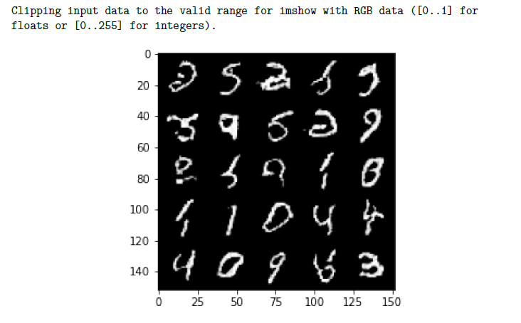

<!-- PROJECT SHIELDS -->


[](https://www.linkedin.com/in/raminferdos/)
[
](mailto:ferdos.ramin@gmail.com)
[](https://simplyramin.github.io/)

<!-- PROJECT LOGO -->
<br />
<div align="center" id=readme-top>
  <h3 align="center">Educational "GANs" Implementations</h3>

  <p align="center">
    Implementing some of the famous GANs architectures.
    <br />
    <a href="https://github.com/SimplyRamin/GANs"><strong>Explore the docs »</strong></a>
    <br />
    <br />
    <a href="https://github.com/SimplyRamin/GANs">View Demo</a>
    ·
    <a href="https://github.com/SimplyRamin/GANs/issues">Report Bug</a>
    ·
    <a href="https://github.com/SimplyRamin/GANs/issues">Request Feature</a>
  </p>
</div>


<!-- TABLE OF CONTENTS -->
<details>
  <summary>Table of Contents</summary>
  <ol>
    <li>
      <a href="#about-the-project">About The Project</a>
      <ul>
        <li><a href="#overview">Overview</a></li>
        <li><a href="#gan-architectures-included">GAN Architectures Included</a></li>
        <li><a href="#built-with">Built With</a></li>
      </ul>
    </li>
    <li><a href="#usage">Usage</a></li>
    <li><a href="#contributing">Contributing</a></li>
    <li><a href="#license">License</a></li>
    <li><a href="#contact">Contact</a></li>
    <li><a href="#acknowledgments">Acknowledgments</a></li>
  </ol>
</details>


<!-- ABOUT THE PROJECT -->
## About The Project



### Overview

This repository contains a collection of Generative Adversarial Network (GAN) architectures implemented in Python using the PyTorch library. These implementations serve as educational resources for those interested in understanding and working with GANs.

### GAN Architectures Included

1. ***Conditional GAN (CGAN)***:

- Two variations of Conditional GANs are implemented, allowing for conditional image generation based on label information.

2. ***Deep Convolutional GAN (DCGAN)***:

- A Deep Convolutional GAN is designed for generating high-quality images. It introduces convolutional layers for improved performance.

3. ***GAN with MNIST Dataset***:

- A basic GAN model is trained on the MNIST dataset to generate handwritten digits.

4. ***Simple GAN for Number Generation***:

- A straightforward GAN architecture for generating numerical data, such as sequences of numbers.

5. ***InfoGAN (Information Maximizing GAN)***:

- An InfoGAN model that learns disentangled representations and allows for the control of specific attributes in generated images.

### Built With

This research project was powered by a robust set of tools, libraries, and frameworks that facilitated data processing, analysis, and visualization:

- 
 The primary programming language for data manipulation, analysis, and visualization.

-  Used for interactive data exploration, analysis, and documentation, providing an intuitive environment for code execution and visualization.

-  An open-source deep learning framework for flexible and dynamic neural network development.

-  scikit-learn is a versatile machine learning library in Python that offers simple and efficient tools for data analysis and modeling, including classification, regression, clustering, and more.

-  NumPy is a fundamental package for scientific computing with Python, providing support for arrays and matrices, as well as a wide range of mathematical functions.

-  A versatile data manipulation library for cleaning, processing, and analyzing structured data.

-  A powerful statistical data visualization library that enhances the presentation of insights through beautiful and informative plots.

-  A widely-used data visualization library that offers extensive customization and control over plot aesthetics.

<p align="right">(<a href="#readme-top">back to top</a>)</p>

<!-- HOW TO USE THIS REPOSITORY -->
## Usage
- Clone this repository to your local machine if you wish to replicate or build upon the work presented here.
```bash
git clone https://github.com/SimplyRamin/GANs.git
```

- Open the notebook you want to check.

<p align="right">(<a href="#readme-top">back to top</a>)</p>

<!-- CONTRIBUTING -->
## Contributing

Contributions are what makes the open-source community such an amazing place to learn, inspire, and create. Any contributions you make are **greatly appreciated**.

If you have a suggestion that would make this better, please fork the repo and create a pull request. You can also simply open an issue with the tag "enhancement".
Don't forget to give the project a star! Thanks again!

1. Fork the Project
2. Create your Feature Branch (`git checkout -b feature/AmazingFeature`)
3. Commit your changes (`git commit -m 'Add some AmazingFeature'`)
4. Push to the Branch (`git push origin feature/AmazingFeature`)
5. Open a Pull Request

<p align="right">(<a href="#readme-top">back to top</a>)</p>


<!-- LICENSE -->
## License

Distributed under the MIT License. See `LICENSE.txt` for more information.

<p align="right">(<a href="#readme-top">back to top</a>)</p>


<!-- CONTACT -->
## Contact

Ramin F. - [@SimplyRamin](https://www.linkedin.com/in/raminferdos/) - ferdos.ramin@gmail.com - [Website](https://GANs)

Project Link: [https://github.com/SimplyRamin/GANs](https://github.com/SimplyRamin/GANs)

<p align="right">(<a href="#readme-top">back to top</a>)</p>


<!-- ACKNOWLEDGMENTS -->
## Acknowledgments

I would like to express my gratitude to the data science community for its constant inspiration and support. This project is a testament to the power of data-driven insights and the endless possibilities they offer in understanding and optimizing social media engagement.


<p align="right">(<a href="#readme-top">back to top</a>)</p>